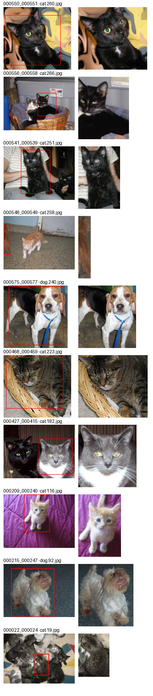

# Auditoría de recortes COCO (P3-04)

Muestra de **10** recortes al azar (semilla `42`) de **668** recortes válidos. Cada fila compara la imagen de origen con su caja COCO dibujada (arriba) contra el recorte generado (abajo).

| # | crop_id | origen | annotation_id | categoría | bbox (x, y, w, h) | recorte |
|---|---|---|---|---|---|---|
| 1 | `000550_000551` | `cat.260.jpg` | 551 | cat | (10.800018310546875, 59.69999694824219, 411.1999816894531, 369.6000061035156) | 412x371 |
| 2 | `000556_000558` | `cat.266.jpg` | 558 | cat | (239.60003662109375, 113, 131.199951171875, 161.60000610351562) | 132x162 |
| 3 | `000541_000539` | `cat.251.jpg` | 539 | cat | (122, 24.20001220703125, 206.4000244140625, 307.1999816894531) | 207x308 |
| 4 | `000548_000549` | `cat.258.jpg` | 549 | cat | (0, 38.100006103515625, 31.20001220703125, 157.60003662109375) | 32x158 |
| 5 | `000575_000577` | `dog.240.jpg` | 577 | dog | (28, 4.70001220703125, 294.4000244140625, 316.0000305175781) | 295x317 |
| 6 | `000468_000459` | `cat.223.jpg` | 459 | cat | (17.70001220703125, 13.699996948242188, 396.79998779296875, 356.8000183105469) | 398x358 |
| 7 | `000427_000415` | `cat.182.jpg` | 415 | cat | (247.10003662109375, 97.80001831054688, 235.199951171875, 250.4000244140625) | 236x252 |
| 8 | `000209_000240` | `cat.116.jpg` | 240 | cat | (143.4453125, 0, 180.171875, 263.66796875) | 181x264 |
| 9 | `000215_000247` | `dog.92.jpg` | 247 | dog | (33.2578125, 19.8515625, 189.02734375, 213.1484375) | 190x214 |
| 10 | `000022_000024` | `cat.19.jpg` | 24 | cat | (135.828125, 90.70703125, 68.1953125, 95.30859375) | 70x97 |

**Firmado por:** Angel Piña  **Fecha:** 29 de septiembre del 2026
